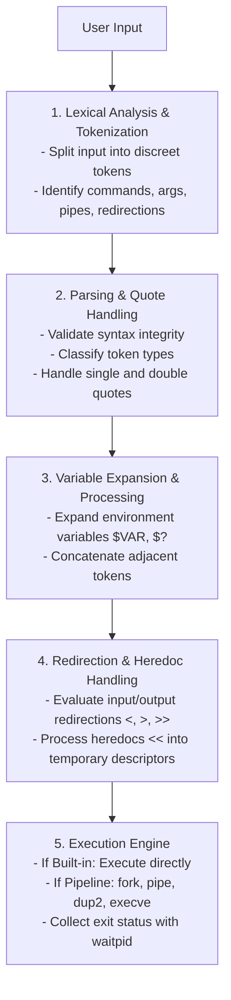
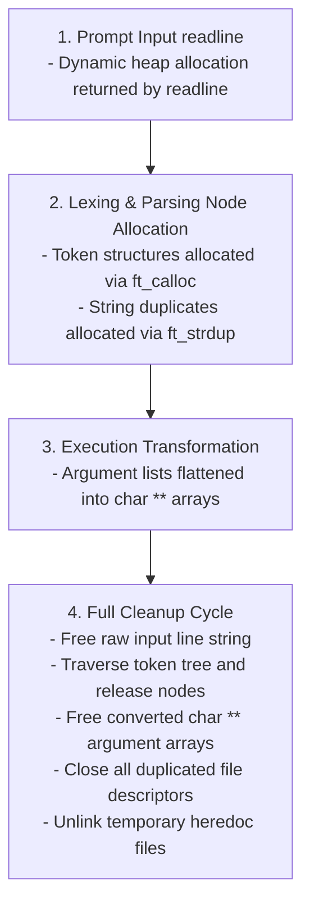

*This project has been created as part of the 42 curriculum by agalvan-.*

# Minishell

## Description

**Minishell** is a custom UNIX command-line interpreter developed in C as a core milestone of the 42 curriculum. The primary objective of this project is to recreate a fully functional shell modeled after GNU Bash. Developing a shell requires a deep understanding of low-level system calls, process creation and synchronization, file descriptor manipulation, signal handling, and complex lexical and syntactic parsing.

Minishell features a complete execution pipeline capable of reading user input, parsing single and double quotes, expanding environment variables, handling input/output redirections (`<`, `>`, `<<`, `>>`), setting up inter-process communication via pipes (`|`), managing background/foreground processes, handling interactive signal states, and running both standard system binaries and built-in commands.

Here is the expanded section detailing shell theory, tokenization, and parsing to include in your `README.md`.

---

## Shell Theory and Core Concepts

A shell is a command-line interpreter that acts as the primary interface between the user and the operating system kernel. It operates a continuous read-eval-print loop (REPL) that translates human-readable text into low-level system calls.

The theoretical foundation of a UNIX shell relies on two main pillars:

* **Process Management:** The shell uses `fork()` to clone its own process. The parent process uses `wait()` or `waitpid()` to monitor the child, while the child uses `execve()` to replace its memory space with the requested binary program.
* **Inter-Process Communication (IPC) and I/O:** Every process starts with three default file descriptors: standard input (0), standard output (1), and standard error (2). A shell manipulates these streams using `pipe()` to pass data between concurrent processes and `dup2()` to redirect inputs and outputs to physical files.

## The Tokenization Process

Lexical analysis, or tokenization, is the first mechanical step in interpreting user input. It breaks a continuous string of characters into discrete, manageable units called tokens.

* **State Machine Logic:** The tokenizer scans the string character by character, maintaining a "state" (e.g., `UNQUOTED`, `IN_SINGLE_QUOTE`, `IN_DOUBLE_QUOTE`).
* **Metacharacter Detection:** It identifies shell operators (`|`, `<`, `>`, `<<`, `>>`) and isolates them as independent tokens, even if they are not surrounded by spaces.
* **Word Grouping:** Consecutive alphanumeric characters are grouped into `TOKEN_WORD`. If a space is encountered while inside a quoted state, it is treated as a literal character rather than a word separator.

## Parsing and Syntax Validation

While tokenization identifies the "words," parsing attempts to understand the "sentence." The parser iterates through the token list to build an execution-ready structure and enforce shell grammar.

* **Syntax Checking:** The parser ensures operators are used legally. For example, it throws a syntax error if a pipeline operator (`|`) lacks a preceding or succeeding command, or if a redirection (`>`) lacks a target file.
* **Variable Expansion:** It detects `TOKEN_WORD` entries containing unescaped `$` symbols and substitutes them with their corresponding values from the environment linked list.
* **Quote Removal:** Once expansions are complete, the parser strips the outer single and double quotes, passing only the literal inner string to the execution engine.

---

## Instructions

### Compilation

The project uses a standard `Makefile` compiled with `gcc` or `clang` and strictly adheres to the flags `-Wall -Wextra -Werror`.

```bash
# Clone the repository
git clone https://github.com/agalvan-/Minishell.git
cd Minishell

# Compile the executable
make

# Clean object files
make clean

# Clean object files and binary
make fclean

# Recompile the project
make re


```

### Execution

Once compiled, launch the interactive prompt:

```bash
./minishell


```

To run with verbose debugging modes activated (if compiled with debug flags or verbose utilities):

```bash
./minishell --verbose


```

---

## Technical Architecture and Workflow

The shell operates as an interactive REPL (Read-Eval-Print Loop). Input strings undergo sequential processing pipeline stages: lexical analysis (tokenization), syntax parsing, variable expansion and quote removal, process creation and redirection setup, and command execution with status code collection.

### Execution Pipeline Overview



---

## Theoretical Foundation and Implementation Mechanics

### 1. Lexical Analysis (Tokenization)

Lexical analysis is the initial phase where an uninterrupted input string read from `readline()` is broken down into atomic units called **tokens**. Each token represents a logical element with explicit boundaries and semantics.

* **Token Types**:
* `TOKEN_WORD`: Command names, arguments, or file paths.
* `TOKEN_PIPE`: The pipeline operator `|`.
* `TOKEN_REDIR_IN`: Input redirection `<`.
* `TOKEN_REDIR_OUT`: Output redirection `>`.
* `TOKEN_HEREDOC`: Here-document operator `<<`.
* `TOKEN_APPEND`: Append output redirection `>>`.
* `TOKEN_ENV_VAR`: Environment variable expression starting with `$`.
* **Implementation Details**:
* Located under `source/tokenization/`.
* `tokenizer.c` scans characters sequentially, respecting state machines for single and double quote bounders.
* `create_token.c` allocates linked-list nodes storing raw string fragments, token type identifiers, and positional flags.
* `connect.c` stitches token nodes into a doubly linked sequence.

### 2. Syntax Parsing and Word Detection

The parser processes the linear array of tokens to construct an executable abstraction structure, validating command syntax against shell rules (e.g., preventing consecutive pipes `||` or hanging redirections without target files).

* **Quoting Rules**:
* **Single Quotes (`'`)**: Suppress all variable expansions and special character evaluations. Every character inside single quotes is treated literally.
* **Double Quotes (`"`)**: Preserve literal string interpretation while allowing environment variable expansion via `$`.
* **Concatenation and Word Boundary Processing**:
* Words like `"Hello "`$USER are merged post-expansion into single argument strings.
* `source/parser/quote_detection.c` tracks active quote states using state flags (`IN_SINGLE_QUOTE`, `IN_DOUBLE_QUOTE`).
* `source/parser/word_detection.c` splits tokens along whitespace outside valid quotes.

### 3. Environment Variables and Expansion

Environment variables are stored as a dynamic doubly linked list in memory rather than relying solely on `getenv()`/`setenv()`, allowing scope control and explicit modification.

* **Variable Expansion Pipeline**:
* Occurs prior to command execution.
* Scanning functions in `source/detection/variable_detection.c` identify `$` triggers.
* `$NAME` searches the internal key-value list (`source/env/variable.c`) and substitutes the key with its corresponding value string.
* `$?` is a special case expanded by `source/execution/status.c` into the exit status integer of the last executed foreground command.
* Unset or undefined variables resolve to empty strings without raising syntax errors.

### 4. File Descriptors, Redirections, and Pipes

Redirections and pipelines manipulate standard file descriptors: Standard Input (`0` / `STDIN_FILENO`), Standard Output (`1` / `STDOUT_FILENO`), and Standard Error (`2` / `STDERR_FILENO`).

* **Redirection Types**:
* **Input Redirection (`<`)**: Opens target file in `O_RDONLY` mode and uses `dup2(fd, STDIN_FILENO)` to replace standard input.
* **Output Redirection (`>`)**: Opens/creates file with `O_WRONLY | O_CREAT | O_TRUNC` and uses `dup2(fd, STDOUT_FILENO)`.
* **Append Redirection (`>>`)**: Opens/creates file with `O_WRONLY | O_CREAT | O_APPEND`.
* **Here-Document (`<<`)**: Spawns an interactive read loop using `readline()` until a specified delimiter line is matched. The collected lines are piped into a temporary file descriptor or pipe buffer passed as `STDIN` to the command.
* **Pipelines (`|`)**:
* For $N$ commands connected by pipes, $N-1$ pipe pairs are created via `pipe(int pipefd[2])`.
* `pipefd[0]` serves as the read end; `pipefd[1]` serves as the write end.
* Foreground processes are created via `fork()`.
* Parent process closes unused pipe ends to ensure EOF (End of File) signals are transmitted properly across child processes.

### 5. Execution Engine and System Binaries

Command execution is managed by `source/execution/execution.c`:

* **Path Resolution**:
* Absolute paths (`/bin/ls`) or relative paths (`./minishell`) are validated directly via `access(path, X_OK)`.
* Command names (`ls`) trigger a lookup in the `PATH` environment variable. The PATH string is split by `:` delimiters, and candidate directory paths are probed sequentially (`/usr/bin/ls`, `/bin/ls`).
* **Execution Dispatch**:
* Commands are passed to `execve(const char *pathname, char *const argv[], char *const envp[])` inside child processes.
* Parent waits for child execution completion via `waitpid()` and translates status codes via `WIFEXITED` and `WEXITSTATUS`.

### 6. Built-in Commands

Built-in commands execute inside the shell's process context when run independently to alter the shell state directly. In a multi-command pipeline, built-ins execute within child processes.

| Built-in | Logic & Purpose | File Location |
| --- | --- | --- |
| `echo [-n]` | Prints arguments to STDOUT; `-n` suppresses trailing newline. | `source/built_in/built_in.c` |
| `cd [path]` | Changes working directory using `chdir()` and updates `PWD` / `OLDPWD`. | `source/built_in/built_in.c` |
| `pwd` | Prints absolute path of current directory using `getcwd()`. | `source/built_in/built_in.c` |
| `export [key=val]` | Sets environment variables or exports keys without values. | `source/built_in/export.c` |
| `unset [key]` | Removes specified variable node from internal environment list. | `source/built_in/built_in.c` |
| `env` | Prints all active environment key-value pairs. | `source/built_in/built_in.c` |
| `exit [code]` | Terminates shell loop, frees memory, and returns exit code. | `source/built_in/built_in.c` |

### 7. Signal Handling and Terminal Dynamics

Signal handling relies on standard POSIX signal handlers implemented with `sigaction()`.

* **Global Variable**: A single global variable `g_signal` records incoming signal numbers, preventing data structure corruption inside async-signal handlers.
* **Interactive Mode**:
* `SIGINT` (`Ctrl+C`): Displays a new prompt line without terminating.
* `SIGQUIT` (`Ctrl+\`): Ignored (`SIG_IGN`).
* `EOF` (`Ctrl+D`): Signals end of file to `readline()`, exiting the shell.
* **Child Execution Mode**: Signals are reset to default behavior (`SIG_DFL`) within child processes before calling `execve()`.

---

## Directory and File Structure Breakdown

Below is the complete architectural map of the codebase detailing the responsibility of each folder and source file:

```
Minishell/
├── Makefile
├── minishell.h
├── main.c
├── history.log
├── README.md
└── source/
    ├── built_in/
    ├── concatenate/
    ├── detection/
    ├── env/
    ├── error/
    ├── execution/
    ├── exit_free/
    ├── get/
    ├── header/
    ├── init/
    ├── is/
    ├── libft/
    ├── parser/
    ├── processing/
    ├── redirection/
    ├── tokenization/
    └── verbose/


```

### Core Root Files

* `main.c`: Primary entry point; initializes environment structures, launches the main loop (`readline`), dispatches parsing and execution pipelines, and controls exit cleanups.
* `minishell.h`: Master header file including standard libraries, data type definitions, macros, and function prototypes.
* `Makefile`: Automates compilation with strict rule dependencies.
* `history.log`: File tracking prompt command history across shell sessions.

### `source/built_in/`

* `built_in.c`: Core implementation logic for standard built-ins (`echo`, `cd`, `pwd`, `unset`, `env`, `exit`).
* `builtin_exec.c`: Router identifying whether a command is a built-in and executing it in the correct process context.
* `export.c`: Variable insertion logic, handling syntax checks for keys and dynamic list updates for `export`.

### `source/concatenate/`

* `concatenate.c`: Merges contiguous string tokens into unified arguments post variable expansion.
* `list_to_array.c`: Converts linked lists of argument tokens into standard `char **` NULL-terminated arrays required by `execve`.

### `source/detection/`

* `argument_extraction.c`: Extracts positional arguments associated with parsed commands.
* `classification.c`: Evaluates extracted string literals and classifies them into token categories.
* `extraction.c`: Sub-string extraction primitives using index offsets.
* `variable_detection.c`: Scans token characters for unescaped `$` signs to mark expansion targets.

### `source/env/`

* `chained.c`: Memory allocation and linked list insertion routines for environment variables.
* `create_env_var.c`: Instantiates key-value pair structures from raw `KEY=VALUE` strings.
* `env_var_value.c`: Utility function querying an environment key and returning its mapped string value.
* `line.c`: Formats environment linked list nodes back into array lines for external program execution.
* `prompt.c`: Builds and formats the dynamic interactive terminal prompt line.
* `read_line.c`: Wraps GNU `readline` functions, managing input buffers and command history.
* `signal.c`: Sets up `sigaction` signal configurations for interactive, execution, and heredoc modes.
* `variable.c`: Modifies, fetches, or deletes environment records within the environment linked list.

### `source/error/`

* `error.c`: Standardized error printer outputting formatted error strings to `STDERR` (`2`).
* `error_built_in.c` & `error_builtin.c`: Handles specialized parameter error messages for built-in execution failures.
* `error_cmd.c`: Formats "command not found", "permission denied", or directory execution errors.
* `error_env.c`: Manages variable key syntax errors (e.g., invalid identifiers in `export`).
* `error_redirect.c`: Formats errors related to file access failures during redirections.

### `source/execution/`

* `access.c`: Checks path permissions and binary existence using `access()` system calls.
* `bin_exe.c`: Performs binary lookup across `PATH` directories and invokes `execve()`.
* `execution.c`: Orchestrates pipeline process forks, pipe initializations, file descriptor redirections, and process loops.
* `status.c`: Evaluates process wait statuses and stores exit code states ($?).

### `source/exit_free/`

* `disconnect.c`: Safely closes file descriptors and unlinks temporary heredoc files.
* `free.c`: Top-level heap deallocation functions clearing full command trees and environment structures.
* `remove_arg.c`: Frees argument lists and element strings.
* `remove.c`: Node deletion helper for linked lists.
* `remove_token.c`: Safely unlinks and frees single token nodes.
* `remove_token_type.c`: Selectively purges token types post-parsing.

### `source/get/`

* Specialized data retrieval functions across structures:
* `get_arg.c`: Extracts argument arrays.
* `get_cmd.c`: Fetches target command name strings.
* `get_env.c`: Pulls specific environment entries.
* `get_next.c`: Buffer stepping utility.
* `get_path.c`: Parses `PATH` variable and returns array of candidate system paths.
* `get_redirection.c`: Parses redirection targets and file descriptors.
* `get_token.c`: Retrieves token sequences matching specified filters.
* `get.c`: General struct getter utilities.

### `source/header/`

* Internal modular header definitions grouping prototypes logically:
* `class.h`: Classification structures.
* `execution.h`: Pipeline execution declarations.
* `free.h`: Memory cleaning prototypes.
* `get.h`: Getter function signatures.
* `is.h`: Predicate assertions.
* `token.h`: Token definitions.
* `verbose.h`: Verbose logger declarations.
* `header.txt`: ASCII art header string.

### `source/init/`

* `init_env.c`: Clones system environment `envp` array into internal linked list structures upon program startup.
* `init_redirect.c`: Initializes default input/output file descriptor state structures.
* `init_token.c`: Prepares token linked list heads.

### `source/is/`

* Boolean check utilities enforcing parsing assertions:
* `is_builtin.c`: Asserts whether a command string matches a built-in function.
* `is_cmd.c` & `is_cmd_arg.c`: Validates command token syntax.
* `is_redirection.c` & `is_basic_redirection.c`: Checks for redirection symbols (`<`, `>`, `>>`, `<<`).
* `is_quote.c`: Identifies quote characters.
* `is_variable.c`: Identifies valid environment variable naming patterns.
* `is_blank.c`, `is_fd.c`, `is_file.c`, `is_finish.c`, `is_line.c`, `is_same.c`, `is_separator.c`, `is_token.c`, `is_token_cmd.c`, `is_token_redir.c`, `have.c`, `have_cmd.c`, `is.c`.

### `source/libft/`

* Custom support library tailored for memory management, string manipulation, formatting, and file I/O:
* `array/`: Helper routines for 2D array creation, joining, and copying.
* `chained_list/`: Standard generic linked list utilities (`ft_lstadd_back`, `ft_lstclear`, etc.).
* `check/`: Character type identification (`ft_isalpha`, `ft_isdigit`) and string inspection (`ft_strlen`, `ft_strncmp`).
* `conversion/`: Integer and string conversion routines (`ft_atoi`, `ft_itoa`, `ft_split`, `ft_strdup`, `ft_strjoin`).
* `free/`: Memory management and array destruction tools.
* `get_next_line/`: Line reading library for file descriptor parsing and heredoc capture.
* `memory/`: Low-level byte operations (`ft_memset`, `ft_memcpy`, `ft_calloc`, `ft_bzero`).
* `printf/`: Custom formatted printing implementation (`ft_printf`, `ft_printf_fd`).
* `verbose/`: Standard error output writers (`ft_putstr_fd`, `ft_putendl_fd`).

### `source/parser/`

* `parsing.c`: Master parser coordinator translating token streams into executable command structures.
* `quote_detection.c`: Detects quote boundaries and isolates quoted content.
* `redirection_detection.c`: Validates redirection operators and targets.
* `word_detection.c`: Breaks character streams into unquoted lexemes.
* `casting.c`: Converts generic token data types into specialized command representations.

### `source/processing/`

* `bin_processing.c`: Prepares external binary paths and argument vectors for `execve` calls.
* `processing_built.c`: Prepares parameters and environment contexts for built-in commands.
* `processing_cmd.c`: Assembles full execution units.
* `processing_redir.c`: Evaluates file opening modes and configures file redirection descriptors.
* `variable_value.c`: Resolves target variable names against internal environment storage.

### `source/redirection/`

* `redirect.c`: Applies `dup2()` descriptor redirections for execution sub-processes.
* `manage_redirect.c`: Manages file handle opening flags (`O_RDONLY`, `O_WRONLY`, `O_CREAT`, `O_TRUNC`, `O_APPEND`).
* `heredoc.c`: Executes heredoc input loops, writing input to temporary descriptors until the delimiter line is received.
* `close.c`: Closes duplicated file descriptors to prevent file descriptor leaks.

### `source/tokenization/`

* `tokenization.c` & `tokenizer.c`: Top-level tokenization routines scanning user input.
* `cmd_tokenizer.c`: Groups lexemes into distinct command blocks separated by pipeline operators (`|`).
* `quote_tokenizer.c`: Handles quoted token grouping.
* `create_token.c`: Instantiates token nodes with classification flags.
* `connect.c`: Links token nodes into sequence structures.

### `source/verbose/`

* Debugging framework outputting internal state inspection logs:
* `verbose.c`, `verbose_token.c`, `verbose_cmd.c`, `verbose_env.c`, `verbose_redirect.c`, `verbose_class.c`, `verbose_env_var.c`, `verbose_env_var_fd.c`, `verbose_basic_redir.c`.

---

## Memory and Cleanup Lifecycle

To ensure zero memory leaks and strict compliance with project constraints, every allocated memory block follows a clear ownership cycle:



---

## Resources

### Documentation and Literature

* [GNU Bash Reference Manual](https://www.google.com/search?q=https://www.gnu.org/software/bash/manual/) - Official specification of Bash behavior and syntax.
* [Advanced Programming in the UNIX Environment (APUE)](http://www.apuebook.com/) by W. Richard Stevens - Fundamental reference for process control, signals, and file I/O.
* [The Linux Programming Interface](https://man7.org/tlpi/) by Michael Kerrisk - Detailed guide on POSIX system calls (`fork`, `execve`, `pipe`, `dup2`).
* [Writing Your Own Shell in C](https://www.google.com/search?q=https://drewdevault.com/2018/01/04/Writing-a-shell-in-C.html) - Conceptual overview of REPL architecture and file descriptor handling.

### Artificial Intelligence Usage

In compliance with 42 curriculum guidelines, Artificial Intelligence (Large Language Models) was used as an assistive tool throughout development:

* **Tasks and Usage**:
* **Architectural Brainstorming**: Designing the initial tokenization state machine and planning execution pipelines.
* **Debugging & Edge Case Discovery**: Analyzing signal edge cases (e.g., heredoc termination via `Ctrl+C`) and file descriptor leak conditions.
* **Code Verification**: Reviewing edge-case syntax rules for double quote variable expansion.
* **Documentation**: Assisting in structuring and generating the comprehensive technical project documentation.
* **Verification**: All AI-assisted designs and code structures were validated, manually tested against Bash behaviors, and verified for compliance.
