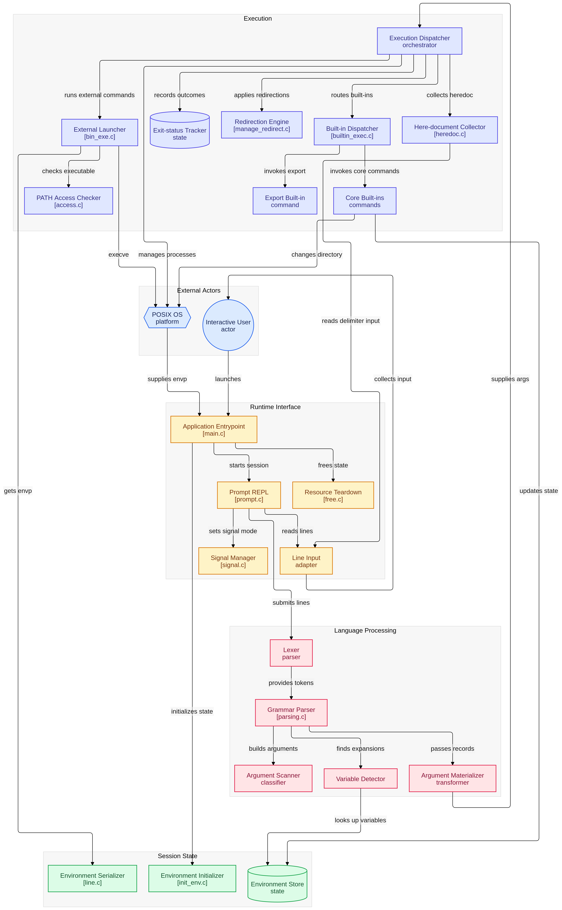
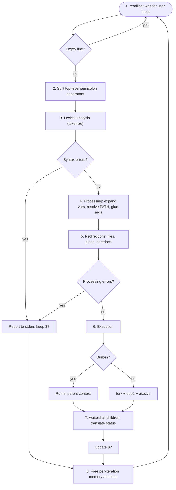
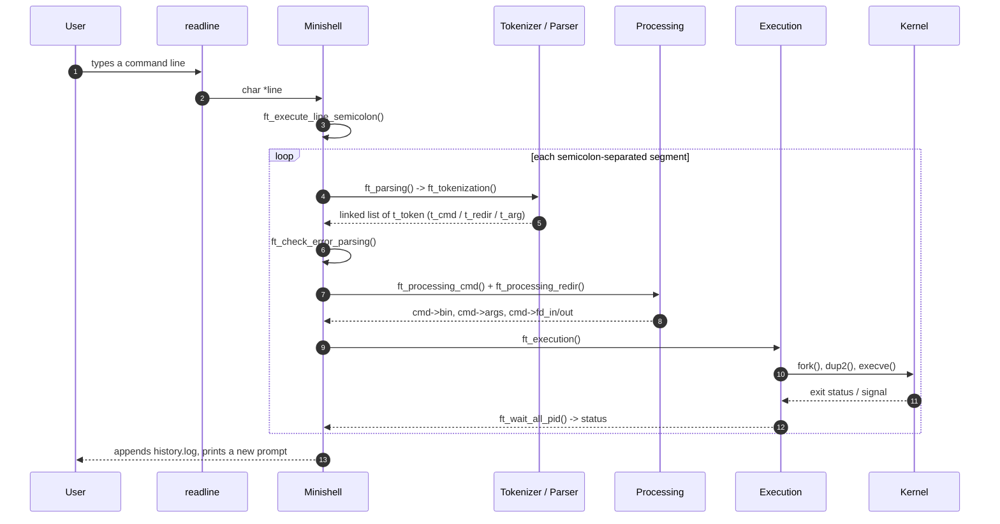
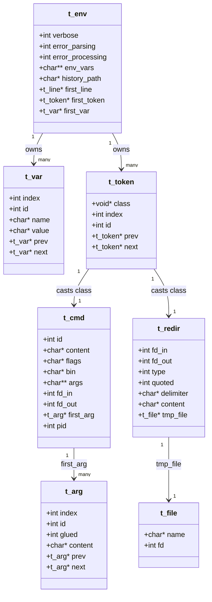
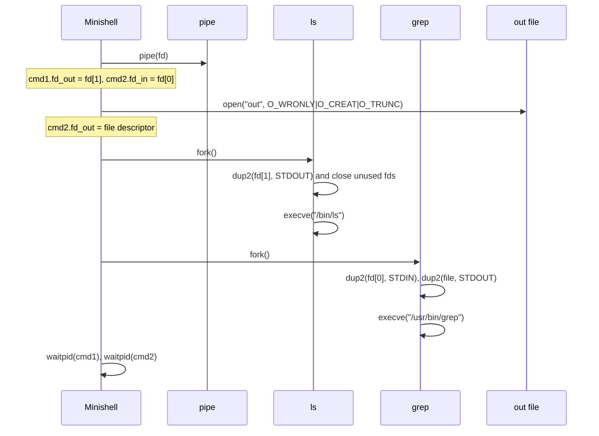
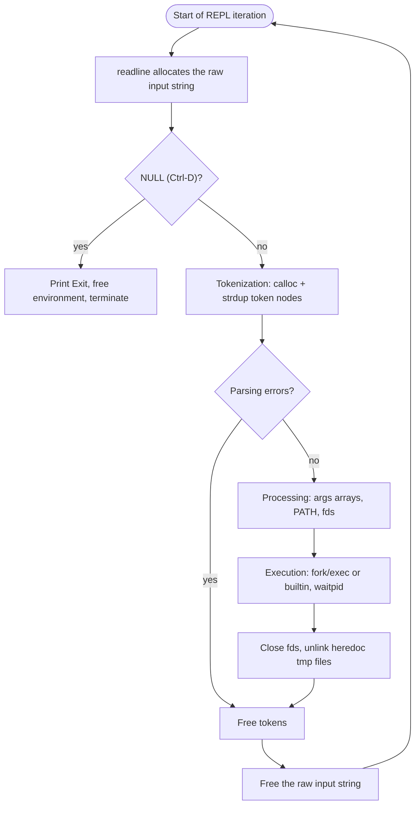

*This project has been created as part of the 42 curriculum by agalvan-.*


<!-- ASCII banner: the same art is printed by `make` from source/header/header.txt. -->
<p align="center">
<pre>
███╗   ███╗██╗███╗   ██╗██╗███████╗██╗  ██╗███████╗██╗     ██╗
████╗ ████║██║████╗  ██║██║██╔════╝██║  ██║██╔════╝██║     ██║
██╔████╔██║██║██╔██╗ ██║██║███████╗███████║█████╗  ██║     ██║
██║╚██╔╝██║██║██║╚██╗██║██║╚════██║██╔══██║██╔══╝  ██║     ██║
██║ ╚═╝ ██║██║██║ ╚████║██║███████║██║  ██║███████╗███████╗███████╗
╚═╝     ╚═╝╚═╝╚═╝  ╚═══╝╚═╝╚══════╝╚═╝  ╚═╝╚══════╝╚══════╝╚══════╝
</pre>
</p>

<p align="center">
  <b>Pipes</b> &middot; <b>Redirections</b> &middot; <b>Here-documents</b> &middot; <b>Signals</b> &middot; <b>Built-ins</b>
  <br>
  <sub>A from-scratch UNIX shell written in C for the 42 curriculum &mdash; no shell frameworks, just syscalls.</sub>
</p>

<p align="center">
  
  
  
  
  
</p>

# Minishell

> *A from-scratch UNIX shell written in C: tokenizing, pipes, redirections, here-documents, signals and built-ins &mdash; one syscall at a time.*

## Table of Contents

- [Description](#description)
- [Shell Theory and Core Concepts](#shell-theory-and-core-concepts)
- [The Tokenization Process](#the-tokenization-process)
- [Parsing and Syntax Validation](#parsing-and-syntax-validation)
- [Instructions](#instructions)
- [Technical Architecture and Workflow](#technical-architecture-and-workflow)
- [Theoretical Foundation and Implementation Mechanics](#theoretical-foundation-and-implementation-mechanics)
- [Directory and File Structure Breakdown](#directory-and-file-structure-breakdown)
- [Memory and Cleanup Lifecycle](#memory-and-cleanup-lifecycle)
- [Resources](#resources)

## Description

**Minishell** is a custom UNIX command-line interpreter written in C as a core milestone of the 42 curriculum. Its goal is to reproduce a practically useful subset of GNU Bash behavior: a REPL that reads a line, tokenizes it, validates it, expands variables, sets up redirections and pipes, executes built-ins and external binaries, and tracks the exit status of the last foreground command.

The project is built around a **linked-list, class-based data model**: every token carries a polymorphic `class` pointer that is later *cast* to a concrete structure (`t_cmd`, `t_redir`, `t_arg`, `t_file`, …). There is no abstract syntax tree; the token list *is* the intermediate representation, and the pipeline mutates it stage by stage (tokenize → process → execute).

### Supported syntax

| Feature | Examples |
| --- | --- |
| Pipes | `ls \| grep .c \| wc -l` |
| Input redirection | `cat < file.txt` |
| Output redirection / truncate | `echo hi > out.txt` |
| Output redirection / append | `echo hi >> out.txt` |
| Here-documents | `cat << EOF`, `cat << 'EOF'`, `cat << "EOF"` |
| Command separator | `echo one; echo two` |
| Single quotes (literal) | `echo 'no $expansion here'` |
| Double quotes (expandable) | `echo "hello $USER ${USER}"` |
| Variables | `$VAR`, `$?`, `"${VAR}"`, `"$VAR"` |
| Built-ins | `echo [-n]`, `cd`, `pwd`, `export`, `unset`, `env`, `exit` |

### Explicit non-goals / known limitations

These are intentionally out of scope and are **not** part of the tested grammar:

* Logical operators `&&`, `||` (reserved token constants exist, but no evaluation logic).
* Wildcard globbing (`*`, `?`).
* Subshells and grouping: `( ... )`.
* Standalone variable assignment as a command (`VAR=value`); use `export VAR=value` instead.
* Background jobs / job control (`&`).
* Command substitution (`$(...)`, backticks).
* **Unquoted `${VAR}`** is not expanded (`echo ${VAR}` yields an empty line, `echo x${VAR}y` is literal). `${VAR}` *does* work inside double quotes. `$VAR` works both quoted and unquoted.

---

## Shell Theory and Core Concepts

A shell is a command-line interpreter that acts as the primary interface between the user and the operating system kernel. It runs a continuous read-eval-print loop (REPL) that translates human-readable text into low-level system calls.

The theoretical foundation of a UNIX shell relies on two main pillars:

* **Process Management:** The shell uses `fork()` to clone its own process. The parent process uses `wait()` or `waitpid()` to monitor the child, while the child uses `execve()` to replace its memory space with the requested binary program.
* **Inter-Process Communication (IPC) and I/O:** Every process starts with three default file descriptors: standard input (0), standard output (1), and standard error (2). A shell manipulates these streams using `pipe()` to pass data between concurrent processes and `dup2()` to redirect inputs and outputs to physical files.

## The Tokenization Process

Lexical analysis, or tokenization, is the first mechanical step in interpreting user input. It breaks a continuous string of characters into discrete, manageable units called tokens. In this implementation it is a **single left-to-right scan** (`source/tokenization/tokenization.c`) that dispatches either to word classification or redirection classification:

* **Word scanning** (`ft_word_classification`, `source/detection/classification.c`) walks a run of characters up to the next blank or metacharacter, then hands it to `ft_cmd_tokenizer` (`source/tokenization/tokenizer.c`), which builds the command node and then splits its arguments.
* **Redirection scanning** (`ft_redir_classification`) recognizes `|`, `<`, `>`, `>>` and `<<` even when they are glued to words (`echo hi>out`), and extracts the target filename/limiter as its own `t_file`/`t_arg` token.
* **Quote handling** is *not* a global state machine: quotes are isolated by dedicated extractors. `ft_single_tokenization` / `ft_single_tokenizer` capture single-quoted spans verbatim, while `ft_double_tokenization` / `ft_double_tokenizer` (`source/tokenization/quote_tokenizer.c`) capture double-quoted spans and still expand `$VAR`, `${VAR}` and `$?` inside them.
* **Word grouping / gluing:** a character immediately following a quoted or variable fragment with no blank in between is marked with the `glued` flag on `t_arg`, so `"Hello "`$USER is later joined into one argument (`source/concatenate/concatenate.c`).

The complete token vocabulary is defined in `source/header/token.h`; the code currently emits and consumes the subset shown below (the others are reserved for future/experimental grammar):

* `TOKEN_WORD`, `TOKEN_CMD`, `TOKEN_BUILTIN`, `TOKEN_BIN`, `TOKEN_FLAGS`, `TOKEN_ARG`
* `TOKEN_VARIABLE`, `TOKEN_SINGLE_QUOTE`, `TOKEN_DOUBLE_QUOTE`, `TOKEN_BLANK`
* `TOKEN_REDIR`, `TOKEN_PIPE`, `TOKEN_INPUT_CHEVRON`, `TOKEN_OUTPUT_CHEVRON`, `TOKEN_APPEND_CHEVRON`, `TOKEN_HEREDOC`, `TOKEN_LIMITER`
* `TOKEN_FILE`, `TOKEN_STRING`

## Parsing and Syntax Validation

While tokenization identifies the "words," parsing attempts to understand the "sentence." In this codebase the parser is deliberately *lightweight*: `ft_parsing` (`source/parser/parsing.c`) delegates to the tokenizer, and the heavy lifting happens in two later passes:

1. **Command casting** (`source/parser/casting.c`): after the raw token stream exists, each command token's `class` pointer is cast to a `t_cmd`, and its argument list is classified into `TOKEN_FLAGS`/`TOKEN_ARG`/quotes/variables.
2. **Error checking** (`ft_check_error_parsing`, `source/error/`): the parser reports syntax errors (e.g. a pipe or redirection with no command/target) to `STDERR`, increments `env->error_parsing`, and leaves `$?` set. Execution is skipped for that line; the REPL continues.

* **Quoting Rules**: Single quotes suppress all variable expansion and special-character evaluation; every character inside is literal. Double quotes preserve literal interpretation except for `$` expansions, which are resolved against the environment.
* **Quote removal**: after expansion, the surrounding quotes are stripped so only the inner literal string reaches the execution engine.
* **No AST**: the parser does not build a tree. Ordering and grouping are represented implicitly by the doubly-linked token list (`prev`/`next`) and by the `t_cmd`/`t_redir` nodes attached to it.

---

## Instructions

### Compilation

The project uses a standard `Makefile` compiled with `gcc` (or `clang`) and strictly adheres to `-Wall -Wextra -Werror` (plus `-g3` for debugging symbols). It depends only on the GNU `readline` development library.

```bash
# Clone the repository
git clone https://github.com/agalvan-/Minishell.git
cd Minishell

# Compile the executable
make

# Clean object files
make clean

# Clean object files and binary
make fclean

# Recompile from scratch
make re
```

Extra targets for debugging (they rebuild the binary with additional instrumentation):

```bash
make debug      # -g3
make sanitize   # AddressSanitizer
make leak       # LeakSanitizer
```

### Execution

Once compiled, launch the interactive prompt:

```bash
./minishell
```

Verbose mode dumps the internal token/command/redirection linked lists at each pipeline stage. It is enabled with a flag (no interactive Y/N question is asked when stdin is not a TTY):

```bash
./minishell --verbose
```

### Testing

The repository ships two independent harnesses. Both compare minishell against the system `bash` (normalizing the prompt, the `Exit` trailer, the `history` echo and the `bash: line N:` prefix), so they require `bash`, `diff`, `awk` and `sed`. The heavy one additionally needs `python3` (for the pseudo-terminal signal tests) and, with `--vg`, `valgrind`.

```bash
# Focused regression suite: 12 case files + 3 special checks = 15 tests
./tests/run_tests.sh            # compare stdout + stderr against bash
./tests/run_tests.sh --vg       # also require 0 valgrind errors/leaks
./tests/run_tests.sh -v         # list every PASS

# Hard battery: 69 comparison cases + 9 exit-code + 8 pty signals + 1 robustness
./tests/hard_tests.sh                  # 87 tests
./tests/hard_tests.sh --vg             # 156 tests (adds memory/fd checks per case)
./tests/hard_tests.sh --color|--no-color
```

Test assets:

| Path | Purpose |
| --- | --- |
| `tests/run_tests.sh` | Baseline harness, one Bash script per case. |
| `tests/cases/*.txt` | 12 script fixtures (basic, quotes, concat, redir, heredoc, pipeline, cd, status, unset, file ops, errors, heredoc copy). |
| `tests/hard_tests.sh` | Adversarial harness: compares stdout+stderr, checks exit-code encoding, runs PTY signal tests, robustness and valgrind. |
| `tests/hard_cases.txt` | 69 aggregated cases, separated by `##### name` markers. |
| `tests/pty_signals.py` | 8 interactive signal tests over a pseudo-terminal (Ctrl-C, Ctrl-\, Ctrl-D, interrupting `sleep`/`cat`). |

Expected status: `run_tests.sh` 15/15, `hard_tests.sh` 87/87 (156/156 with `--vg`), with no valgrind errors, no definitely/indirectly/possibly lost bytes and no double-closed or invalid file descriptors.

---

## Technical Architecture and Workflow

The shell operates as an interactive REPL (Read-Eval-Print Loop). Each line travels through well-separated stages — lexical analysis (tokenization), syntax parsing, variable expansion and quote removal, process creation with redirection setup, and finally execution with status-code collection. Keeping those stages independent is what makes the pipeline easy to reason about: the tokenizer produces data, the processing pass enriches it, and the executor only consumes it.

### Architecture Diagram

At the highest level, minishell is a loop around `readline` that turns text into `fork`/`execve` calls. The diagram below is the "one-page" map of the project: parsing is on one side (no side effects), execution is on the other (syscalls and file descriptors), and the memory lifecycle closes the loop after every command.

<p align="center">
  
</p>

<p align="center"><sub><b>Figure 1.</b> High-level architecture, from the input line to process exit (<code>source/header/diagram.png</code>).</sub></p>

### Execution Pipeline Overview

The flowchart below follows a single line of input, read top to bottom. Diamond nodes are decision points and rectangular nodes are transformations. Notice that parsing and processing stay strictly separated from execution: if either reports an error, the command is skipped, only `$?` is updated, and the shell returns to the prompt.



The eight stages map to the numbered nodes above:

| # | Stage | What happens |
| --- | --- | --- |
| 1 | Input | `readline("[Minishell]$ ")` returns a heap-allocated line, or `NULL` on Ctrl-D. |
| 2 | Semicolon split | `ft_execute_line_semicolon` cuts top-level `;` segments while respecting quotes. |
| 3 | Tokenization | `ft_tokenization` produces the `t_token` linked list (`t_cmd` / `t_redir` / args). |
| 4 | Processing | Variables are expanded, `PATH` is resolved and glued arguments are materialized. |
| 5 | Redirection | Files are opened, pipes are created and here-documents are captured as `fd_in`/`fd_out`. |
| 6 | Execution | Built-ins run in-process; external commands are forked and handed to `execve`. |
| 7 | Wait | `ft_wait_all_pid` reaps every child and translates the wait status into `$?`. |
| 8 | Cleanup | Descriptors and temporary here-document files are released, then the loop restarts. |

### REPL Sequence

Where the flowchart describes *what* happens, this diagram describes *who* does it and in which order. For a single input line the shell alternates between pure transformations (tokenize, process) and effectful work (exec, wait). The loop body runs once per semicolon-separated segment.



Unlike the flowchart, this diagram is **time-ordered**: it shows who calls whom for a single line. The shell never blocks on an external command until `ft_wait_all_pid`, which is why a pipeline can keep several children alive at once. Built-ins short-circuit the fork/exec path and run directly in the parent so that they can mutate the shell state (`cd`, `export`, `unset`, `exit`).

---

## Theoretical Foundation and Implementation Mechanics

The rest of this section walks through the mechanics stage by stage. The data structures described first are shared by every stage, so they are worth understanding before the algorithms.

### Data Model and Core Structures

Everything the shell knows lives in a handful of linked lists rooted at `t_env`. A line of input becomes a list of `t_token` nodes, and each token's polymorphic `class` pointer is later *cast* to a concrete payload (`t_cmd`, `t_redir`, `t_arg`, …) depending on its `id`. `ft_get_class` is the accessor used throughout the pipeline, which is why the same node can be treated as a command, a redirection or a plain argument without any `union`.



Reading the diagram: `t_env` owns three independent lists — the exported variables (`t_var`), the parsed tokens (`t_token`) and the line queue (`t_line`). A command token owns its ordered arguments through `t_arg`, while a redirection token owns the here-document temporary file through `t_file`. The `glued` flag on `t_arg` records whether an argument was formed by concatenating adjacent fragments (for example `"Hello "` and `$USER`).

### 1. Lexical Analysis (Tokenization)

Lexical analysis is the initial phase where an uninterrupted input string read from `readline()` is broken down into atomic units called **tokens**. Each token represents a logical element with explicit boundaries and semantics.

* **Entry point**: `ft_tokenization` (`source/tokenization/tokenization.c`) advances an index over the line and alternates between `ft_word_classification` and `ft_redir_classification` (`source/detection/classification.c`).
* **Building blocks**:
  * `source/tokenization/tokenizer.c`: `ft_cmd_tokenizer`, `ft_single_tokenizer`, `ft_double_tokenizer`, `ft_var_tokenizer`, `ft_flags_tokenizer`, `ft_arg_extraction`.
  * `source/tokenization/quote_tokenizer.c`: double-quote handling and `${VAR}` support.
  * `source/tokenization/create_token.c`: allocates `t_token` nodes and their concrete `class`.
  * `source/tokenization/connect.c`: links the doubly-linked token list.
  * `source/tokenization/cmd_tokenizer.c`: groups a lexeme into a command block.

### 2. Syntax Parsing and Word Detection

The parser processes the linear list of tokens to build an execution-ready structure, validating command syntax against shell rules (for example, rejecting a redirection with no target).

* **Casting**: `source/parser/casting.c` turns the generic token `class` into a typed `t_cmd`/`t_arg` and enumerates the command's arguments.
* **Quote detection**: `source/parser/quote_detection.c` tracks quoted spans; `source/parser/word_detection.c` splits unquoted lexemes.
* **Redirection detection**: `source/parser/redirection_detection.c` classifies `<`, `>`, `>>`, `<<` and `|`.
* **Variable expansion**: `source/detection/variable_detection.c` scans for unescaped `$` triggers.
* **Error gate**: `ft_check_error_parsing` increments `env->error_parsing` on malformed input; `ft_doesnt_have_error_parsing` (`source/error/error_env.c`) is the gate that decides whether to execute or skip the line.

### 3. Environment Variables and Expansion

Environment variables are stored as a dynamic doubly linked list (`t_var`) rather than relying solely on `getenv()`/`setenv()`, which allows scope control and explicit modification.

* **Variable expansion pipeline**:
  * The environment is cloned from `envp` at startup by `ft_create_chained_var` (`source/init/init_env.c`, `source/env/chained.c`).
  * `$NAME` searches the internal key/value list (`source/env/variable.c`, `source/env/env_var_value.c`) and substitutes the value.
  * `$?` is a special variable injected at startup by `ft_add_signal_env_var` (`source/env/signal.c`) and updated after every command by `ft_update_var_status_process`.
  * `${NAME}` is supported **inside double quotes**; the brace form without quotes is a known limitation (see Description).
  * Unset or undefined variables resolve to an empty string without raising errors.
* **In here-documents**, expansion is applied line by line when the delimiter was *not* quoted: `$VAR` and `$?` are substituted (`ft_heredoc_write_var`, `source/redirection/heredoc.c`).

### 4. File Descriptors, Redirections, and Pipes

Redirections and pipelines manipulate standard file descriptors: Standard Input (`0` / `STDIN_FILENO`), Standard Output (`1` / `STDOUT_FILENO`), and Standard Error (`2` / `STDERR_FILENO`). The rule `isnot_standard_fd` (`fd > STDERR_FILENO`) ensures the shell never closes its own standard streams.

* **Redirection types** (`source/redirection/manage_redirect.c`):
  * **Input (`<`)**: `open(name, O_RDONLY)`, then `dup2(fd, STDIN_FILENO)`.
  * **Output (`>`)**: `open(name, O_WRONLY | O_TRUNC | O_CREAT, 0644)`.
  * **Append (`>>`)**: `open(name, O_WRONLY | O_APPEND | O_CREAT, 0644)`.
  * **Here-document (`<<`)**: `ft_heredoc_prompt` reads raw lines with `mini_get_next_line(STDIN_FILENO)` (not `readline`, so that blank lines are preserved), writes them to `tmp.txt` opened with `O_TRUNC`, then re-opens it `O_RDONLY` as the command's `fd_in`. Quoted delimiters (`<< 'EOF'`) disable expansion; unquoted ones expand `$VAR`/`$?`. A permissive size guard (9999 bytes per line) prevents runaway buffers.
  * On open failure, `ft_redir_open_error` prints `minishell: <name>: <strerror(errno)>` to `STDERR`, sets `$?` to 1 and marks `error_processing`, so the command is not executed with a bogus descriptor.
* **Pipelines (`|`)** (`ft_manage_fd_pipe`):
  * For *N* commands connected by pipes, *N-1* `pipe(int fd[2])` pairs are created.
  * `fd[0]` is the read end, `fd[1]` the write end; each command's `fd_in`/`fd_out` is then updated.
  * `ft_redirect_cmd` (`source/processing/processing_redir.c`) performs the actual `dup2` and closes the original descriptor inside the child, invalidating it to `-1` to prevent double closes.
* **Cleanup** (`source/redirection/close.c`): heredoc temporary files are `close`d and `unlink`ed (`ft_remove_tmp_file`), and remaining non-standard descriptors are closed before waiting on children (`ft_close_all_fd`).

The following diagram traces a single pipeline, `ls | grep x > out`, showing how the two ends of a pipe are split across the commands and how the final output is redirected into a file:



Two details are worth highlighting. First, the parent closes unused pipe ends before forking the next child so that EOF propagates correctly (otherwise `grep` would never see the pipe close). Second, each child resets `SIGINT`/`SIGQUIT` to `SIG_DFL` before calling `execve`, so `Ctrl+C` reaches the running program instead of the shell.

### 5. Execution Engine and System Binaries

Command execution is managed by `source/execution/execution.c`. `ft_execution` walks every command token and calls `ft_execute_cmd`, which dispatches to `ft_builtin_execution` or `ft_bin_execution`.

* **Path resolution**:
  * Absolute/relative paths (`/bin/ls`, `./minishell`) are validated directly with `access(path, X_OK)` (`source/execution/access.c`).
  * Bare names (`ls`) are resolved against `PATH`: `ft_get_list_of_bins` (`source/execution/access.c`) splits the variable, `ft_setup_bin_path` (`source/processing/bin_processing.c`) probes each directory, and `ft_get_cmd_path` (`source/get/get_cmd.c`) returns the resolved path.
* **Directory as command**: if the resolved path is a directory, `ft_bin_execution` prints `minishell: <path>: Is a directory` and returns status **126**.
* **Not found / not executable**: a bare name that cannot be resolved prints `minishell: <name>: command not found` and returns **127**; a path that exists but is not executable prints `Permission denied` and returns **126**.
* **Execution dispatch**: external commands are forked and executed with `execve(path, argv, envp)` after resetting `SIGINT`/`SIGQUIT` to `SIG_DFL` and applying `dup2` redirections. The parent records `cmd->pid`.
* **Status collection**: `ft_wait_all_pid` waits on every forked child, prints a signal message when a child was killed (`Terminated`, `Killed`, `Segmentation fault`, `Quit`, `Aborted`; `SIGINT`/`SIGPIPE` are silent), converts the wait status with `ft_convert_status_process_value` (`128 + signal` for signal deaths), and `ft_get_last_status` decides whether the last built-in status or the last child status wins.

### 6. Built-in Commands

Built-in commands execute inside the shell's process context. `ft_builtin_execution` (`source/built_in/builtin_exec.c`) is the router; `ft_processing_builtin` (`source/processing/processing_built.c`) runs the pre-execution preparation (HOME resolution for `cd`, flag extraction for `echo`, argument validation for `exit`).

| Built-in | Logic & Purpose | File Location |
| --- | --- | --- |
| `echo [-n]` | Prints arguments to `STDOUT`; `-n` suppresses the trailing newline. | `source/built_in/built_in.c` |
| `cd [path]` | Changes directory with `chdir()`, updates `PWD`/`OLDPWD`; no argument uses `$HOME`, `-` uses `$OLDPWD`. | `source/built_in/built_in.c` |
| `pwd` | Prints the absolute path of the current directory with `getcwd()`. | `source/built_in/built_in.c` |
| `env` | Prints all exported key/value pairs. | `source/built_in/built_in.c` |
| `exit [code]` | Terminates the shell (see exit semantics below). | `source/built_in/built_in.c` + `source/processing/processing_built.c` |
| `export [key[=val]]` | Sets/exports variables, validating the identifier. | `source/built_in/export.c` |
| `unset [key]` | Removes a variable node from the internal list. | `source/built_in/export.c` |

**Exit semantics** (`ft_processing_exit`):

| Input | Behavior |
| --- | --- |
| `exit` | Exits with the current `$?`. |
| `exit 42` | Exits with `42 & 0xFF` (e.g. `300 -> 44`, `-1 -> 255`, `007 -> 7`, `256 -> 0`). |
| `exit abc` | `minishell: exit: abc: numeric argument required` on stderr, exits with **2**. |
| `exit 1 2` | `minishell: exit: too many arguments` on stderr, **does not exit**, `$?` = 1. |

### 7. Signal Handling and Terminal Dynamics

Signal handling relies on standard POSIX signal handlers implemented with `sigaction()` (`source/env/signal.c`). A single global `t_env *g_env` gives the handler access to the status variable.

* **Interactive mode**:
  * `SIGINT` (`Ctrl+C`): the handler updates `$?` to **130**, writes a newline and re-displays a fresh prompt with `rl_replace_line`/`rl_on_new_line`/`rl_redisplay`; the shell keeps running.
  * `SIGQUIT` (`Ctrl+\`): ignored (`SIG_IGN`).
  * `EOF` (`Ctrl+D`): `readline` returns `NULL`, the shell prints `Exit` and terminates.
* **Child execution mode**: `ft_use_signal_exec()` ignores `SIGINT`/`SIGQUIT` in the parent while children run, and each child resets them to `SIG_DFL` right before `execve`, so `Ctrl+C` interrupts the foreground process and `$?` becomes 130 (or `128 + signal`). The `pty_signals.py` helper verifies all of this over a real pseudo-terminal.

### 8. Line Separators, Exit Status and Error Reporting

* **Command separator**: `ft_execute_line_semicolon` (`source/env/read_line.c`) splits the raw line on top-level `;` while tracking single/double quotes, then executes each non-empty segment through the full pipeline. This is called from `ft_prompt` (`source/env/prompt.c`).
* **`$?`**: stored as a regular variable named `?`, updated after execution by `ft_update_var_status_process`, and read via `ft_get_env_var_value_with_name`.
* **Error message format**: all errors follow Bash conventions and go to `STDERR` as `minishell: <subject>: <message>`, for example:
  * `minishell: nosuch: command not found` (127)
  * `minishell: /a/b: No such file or directory` (127)
  * `minishell: ./script.sh: Permission denied` (126)
  * `minishell: ./adir: Is a directory` (126)
  * `minishell: cd: /nope: No such file or directory` (`cd` to a missing path)
  * `minishell: out.txt: Permission denied` (redirection open failure, `$?` = 1)
* **Error counters**: `env->error_parsing` and `env->error_processing` gate execution and are reset at the top of each REPL iteration by `ft_reset_counter_error` (`source/error/error_env.c`).

---

## Directory and File Structure Breakdown

Below is the complete architectural map of the codebase detailing the responsibility of each folder and source file:

```
Minishell/
├── Makefile
├── minishell.h
├── main.c
├── history.log
├── README.md
├── source/
│   ├── built_in/
│   ├── concatenate/
│   ├── detection/
│   ├── env/
│   ├── error/
│   ├── execution/
│   ├── exit_free/
│   ├── get/
│   ├── header/
│   ├── init/
│   ├── is/
│   ├── libft/
│   ├── parser/
│   ├── processing/
│   ├── redirection/
│   ├── tokenization/
│   └── verbose/
└── tests/
    ├── run_tests.sh
    ├── hard_tests.sh
    ├── hard_cases.txt
    ├── pty_signals.py
    └── cases/
```

### Core Root Files

* `main.c`: Primary entry point; clones `envp`, builds the shell environment, parses `--verbose`, launches the REPL and frees everything on exit. Declares the global `t_env *g_env`.
* `minishell.h`: Master header including standard libraries, `readline`, `libft` and every modular header, plus the `BUFF_SIZE` macro and the `g_env` declaration.
* `Makefile`: Automatic source discovery via `wildcard`, dependency-aware object compilation, a dependency self-check (`check`), a colored build log and the `debug`/`sanitize`/`leak` targets.
* `history.log`: Runtime log appended by `ft_create_history` (`source/env/prompt.c`) with one line per entered command; its path is `<cwd>/history.log` (or `history.log` as a fallback).

### `source/built_in/`

* `built_in.c`: `ft_echo`, `ft_cd`, `ft_pwd`, `ft_env_builtin` and `ft_exit_builtin`.
* `builtin_exec.c`: Router that identifies the built-in and executes it in the correct context.
* `export.c`: `ft_export_builtin` and `ft_unset`, with identifier syntax validation and list updates.

### `source/concatenate/`

* `concatenate.c`: Removes blank argument nodes and glues adjacent (unquoted/quoted/variable) fragments into single arguments; materializes `cmd->args`.
* `list_to_array.c`: Converts the `t_arg` linked list into the `char **` NULL-terminated array required by `execve`.

### `source/detection/`

* `argument_extraction.c`: Extracts positional arguments for parsed commands.
* `classification.c`: Top-level dispatchers `ft_word_classification`, `ft_redir_classification`, `ft_arg_classification`.
* `extraction.c`: Sub-string extraction primitives (including `ft_strip_delimiter_quotes` for heredoc limiters).
* `variable_detection.c`: Scans for unescaped `$` triggers.

### `source/env/`

* `chained.c`: Linked-list allocation/insertion for environment variables and lines.
* `create_env_var.c`: Builds `t_var` nodes from raw `KEY=VALUE` strings.
* `env_var_value.c`: Looks up a variable value by name.
* `line.c`: Serializes the environment list back into array lines for `execve`.
* `prompt.c`: The REPL loop; calls `ft_get_line`, splits on `;`, resets counters and appends history.
* `read_line.c`: `readline` wrapper (prompt, `ECHOCTL` handling, history) plus `ft_execute_line` and `ft_execute_line_semicolon`.
* `signal.c`: `sigaction` configuration for interactive and execution modes, the `SIGINT` handler and the `?` environment entry.
* `variable.c`: Modifies, fetches and deletes variables in the internal list.

### `source/error/`

* `error.c`: Standardized error printer to `STDERR`.
* `error_built_in.c` & `error_builtin.c`: Built-in parameter/error messages.
* `error_cmd.c`: "command not found" / "permission denied" / directory execution messages.
* `error_env.c`: Error counters and gates (`ft_reset_counter_error`, `ft_doesnt_have_error_parsing`, `ft_doesnt_have_error_processing`).
* `error_redirect.c`: Redirection-related errors.

### `source/execution/`

* `access.c`: Permission/existence checks with `access()` and command-path resolution.
* `bin_exe.c`: `PATH` lookup, directory/not-found handling and `fork` + `execve`.
* `execution.c`: Pipeline orchestration, signal messaging, `waitpid` collection and status update.
* `status.c`: Wait-status translation (`WIFEXITED`/`WEXITSTATUS`, `128 + signal`).

### `source/exit_free/`

* `disconnect.c`: Safely unlinks nodes from their lists.
* `free.c`: Top-level deallocation of the environment and per-iteration structures.
* `remove.c`: Node deletion helpers (including `history_path` and `clear_history`).
* `remove_arg.c`: Frees argument lists and their strings.
* `remove_token.c`: Unlinks and frees token nodes.
* `remove_token_type.c`: Selectively purges token types after parsing.

### `source/get/`

* `get.c`: General struct accessors.
* `get_arg.c`: Argument list accessors.
* `get_cmd.c`: Command accessors.
* `get_env.c`: Environment accessors.
* `get_next.c`: List-stepping helpers.
* `get_path.c`: Splits `PATH` into candidate directories.
* `get_redirection.c`: Redirection/limiter accessors.
* `get_token.c`: Token retrieval by filter (first/last cmd, builtin, bin, redirection, heredoc, …).

### `source/header/`

* Modular headers included by `minishell.h`: `class.h` (structs), `token.h` (token constants + prototypes), `list.h`, `detection.h`, `is.h`, `get.h`, `parser.h`, `processing.h`, `env.h`, `redirection.h`, `execution.h`, `error.h`, `free.h`, `verbose.h`.
* `header.txt`: ASCII-art banner printed by the `Makefile` `check` target.

### `source/init/`

* `init_env.c`: Clones `envp` into the internal list, injects `?`, and computes `history_path`.
* `init_redirect.c`: Initializes default input/output file-descriptor state.
* `init_token.c`: Prepares token list heads.

### `source/is/`

* Boolean predicate utilities enforcing parsing assertions: `is_arg.c`, `is_basic_redirection.c`, `is_blank.c`, `is_builtin.c`, `is_cmd.c`, `is_cmd_arg.c`, `is_fd.c`, `is_file.c`, `is_finish.c`, `is_line.c`, `is_quote.c`, `is_redirection.c`, `is_same.c`, `is_separator.c`, `is_token.c`, `is_token_cmd.c`, `is_token_redir.c`, `is_variable.c`, `have.c`, `have_cmd.c`, `is.c`.

### `source/libft/`

* Custom support library tailored for memory management, string manipulation, formatting and file I/O:
  * `array/`: 2D-array creation, joining, copying.
  * `chained_list/`: Generic linked-list utilities (`ft_lstadd_back`, `ft_lstclear`, …).
  * `check/`: Character/string inspection (`ft_isalpha`, `ft_strlen`, `ft_strncmp`, …).
  * `conversion/`: Numeric/string conversion (`ft_atoi`, `ft_itoa`, `ft_split`, `ft_strdup`, `ft_strjoin`, `ft_substr`, …).
  * `free/`: Memory and array destruction helpers.
  * `get_next_line/`: Line reader over a file descriptor, extended as `mini_get_next_line`, used by here-documents to preserve empty lines.
  * `memory/`: Low-level byte operations (`ft_memset`, `ft_memcpy`, `ft_calloc`, `ft_bzero`, …).
  * `printf/`: Custom `ft_printf` / `ft_printf_fd`.
  * `verbose/`: `ft_putstr_fd`, `ft_putchar_fd`, `ft_putnbr_fd`, `ft_putendl_fd`, `print_array`.

### `source/parser/`

* `parsing.c`: Master parser entry; delegates to the tokenizer and triggers verbose output.
* `casting.c`: Casts generic tokens to concrete command/argument structures.
* `quote_detection.c`: Detects quote boundaries and isolates quoted content.
* `redirection_detection.c`: Validates redirection operators and targets.
* `word_detection.c`: Breaks character streams into unquoted lexemes.

### `source/processing/`

* `bin_processing.c`: Prepares external binary paths and argument vectors.
* `processing_built.c`: Pre-execution built-in preparation, including `ft_processing_exit`.
* `processing_cmd.c`: Coordinates built-in, argument and binary processing.
* `processing_redir.c`: Applies `dup2` redirections and holds `ft_change_fd_cmd`/`ft_redirect_cmd`.
* `variable_value.c`: Resolves variable names against internal storage.

### `source/redirection/`

* `redirect.c`: Maps raw redirection strings to token types (`ft_type_of_redirect`).
* `manage_redirect.c`: Opens files with the right flags, creates pipes and here-documents, and reports open failures when `execve` cannot proceed.
* `heredoc.c`: Reads here-document bodies line by line, writes them to `tmp.txt`, performs expansion and captures an unterminated here-document at EOF.
* `close.c`: Closes duplicated file descriptors and removes here-document temporary files.

### `source/tokenization/`

* `tokenization.c` & `tokenizer.c`: Top-level scan and per-construct tokenizers.
* `cmd_tokenizer.c`: Groups lexemes into distinct command blocks.
* `quote_tokenizer.c`: Quote grouping and `${VAR}` expansion inside double quotes.
* `create_token.c`: Instantiates token nodes and their `class` payloads.
* `connect.c`: Links token nodes into the doubly-linked list.

### `source/verbose/`

* Debugging framework dumping internal state: `verbose.c`, `verbose_token.c`, `verbose_cmd.c`, `verbose_env.c`, `verbose_redirect.c`, `verbose_class.c`, `verbose_env_var.c`, `verbose_env_var_fd.c`, `verbose_basic_redir.c`.

### `tests/`

* `run_tests.sh`, `hard_tests.sh`, `hard_cases.txt`, `pty_signals.py` and `cases/` — see the Testing section above.

---

## Memory and Cleanup Lifecycle

To ensure zero memory leaks and strict compliance with project constraints, every allocated memory block follows a clear ownership cycle. The REPL resets per-iteration state after each line, while the environment and the global `g_env` live until the shell shuts down.



Read the diagram as a single iteration: everything allocated *inside* the loop (tokens, argument arrays, the raw input string) is freed before the next prompt, while the environment list and `g_env` are only released when `readline` returns `NULL`. That split is what keeps repeated commands leak-free under valgrind.

Additional memory-safety rules enforced by the code and verified under `valgrind --track-fds=yes`:

* `ft_close_fd_cmd` only closes descriptors above `STDERR_FILENO` and invalidates them to `-1` to avoid double closes.
* `ft_remove_tmp_file` closes and `unlink`s every here-document temporary file, then frees its `t_file`.
* `ft_remove_all` (on exit) clears the `readline` history, frees `history_path` and releases the environment list.
* The harness ignores `still reachable` bytes coming from `readline`/`terminfo` but fails on any `definitely`, `indirectly` or `possibly lost` block.

---

## Resources

### Documentation and Literature

* [GNU Bash Reference Manual](https://www.gnu.org/software/bash/manual/) - Official specification of Bash behavior and syntax.
* [Advanced Programming in the UNIX Environment (APUE)](http://www.apuebook.com/) by W. Richard Stevens - Fundamental reference for process control, signals and file I/O.
* [The Linux Programming Interface](https://man7.org/tlpi/) by Michael Kerrisk - Detailed guide on POSIX system calls (`fork`, `execve`, `pipe`, `dup2`).
* [Writing Your Own Shell in C](https://drewdevault.com/2018/01/04/Writing-a-shell-in-C.html) - Conceptual overview of REPL architecture and file descriptor handling.

### Diagramming and Visual Documentation Tools

All the diagrams in this README are written in **[Mermaid](https://mermaid.js.org/)**, a text-to-diagram syntax that GitHub/GitLab render natively from fenced code blocks tagged as `mermaid`. Keeping diagrams as text means they live in version control next to the code and are reviewable in pull requests. Recommended tooling if you want to extend or export them:

| Tool | Best for | How to use |
| --- | --- | --- |
| **[Mermaid](https://mermaid.js.org/)** | Flowcharts, sequence, class and state diagrams embedded directly in Markdown. | Paste blocks into [Mermaid Live Editor](https://mermaid.live/) or render with `npx -y @mermaid-js/mermaid-cli -i README.md -o README.pdf`. |
| **[D2](https://d2lang.com/)** | Clean modern architecture diagrams from a concise DSL; good automatic layout. | `d2 architecture.d2 architecture.svg`. |
| **[PlantUML](https://plantuml.com/)** | Formal UML (class, sequence, component) and deployment diagrams. | Online server, `plantuml.jar`, or the VS Code PlantUML extension. |
| **[Graphviz / DOT](https://graphviz.org/)** | Large dependency graphs and automatic graph layout. | `dot -Tsvg graph.dot -o graph.svg`. |
| **[Excalidraw](https://excalidraw.com/)** | Hand-drawn, informal architecture sketches for discussions and README banners. | Web app; export `.excalidraw`/SVG/PNG. |
| **[diagrams.net (draw.io)](https://app.diagrams.net/)** | General-purpose visual diagrams with rich shape libraries. | Web app, desktop app or VS Code extension. |
| **ASCII / Unicode art** | Zero-dependency diagrams that render in any terminal or diff. | Plain text, as used in the directory tree above. |

Suggested convention for this repository: keep the canonical diagrams as Mermaid in the README (so they stay in sync with the code) and export PNG/SVG with `mermaid-cli` only when a static image is needed for a report or presentation.

### Artificial Intelligence Usage

In compliance with 42 curriculum guidelines, Artificial Intelligence (Large Language Models) was used as an assistive tool throughout development:

* **Tasks and Usage**:
  * **Architectural Brainstorming**: Designing the lexical scanning / quote-handling strategy and planning execution pipelines.
  * **Debugging & Edge Case Discovery**: Analyzing signal edge cases (e.g. here-document termination via `Ctrl+C`) and file-descriptor leak conditions.
  * **Code Verification**: Reviewing edge-case syntax rules for double-quote variable expansion.
  * **Automated Testing**: Designing and maintaining the `tests/` batteries (Bash comparison, exit-code encoding, PTY signals, valgrind).
  * **Documentation**: Structuring and generating the technical project documentation and its Mermaid diagrams.
* **Verification**: All AI-assisted designs and code structures were validated, manually tested against Bash behavior, and checked for compliance with the project rules and the 42 Norm.
